# 🚀 devboard-gitops

### GitOps source of truth for DevBoard — ArgoCD-synced, canary-deployed, policy-enforced

This is the GitOps repo for [DevBoard](https://github.com/saadhussain07/devboard) 🗂️ — ArgoCD watches it and syncs every manifest here straight to the cluster. Nothing is applied by hand; a merge to `main` **is** the deploy trigger. 🔁

🏆 Submitted for the **TWS Phase 3 Hackathon — DORA + SOTA Compliance Challenge**, Track A.

| | |
|---|---|
| 📦 **App repo** | https://github.com/saadhussain07/devboard |
| 🌐 **Live app** | https://devboard.15-252-151-45.sslip.io |
| 🙋 **Submitted by** | Saad Hussain |

This README maps each of the six checklist items to the actual manifest behind it, plus a screenshot showing it working in the running cluster — not just declared in YAML and hoped for. ✅

---

## 🗂️ Repo Structure
 
```
devboard-gitops/
├── apps/                            # ArgoCD Application manifests (app-of-apps entrypoints)
│   ├── devboard.yaml                 # Points ArgoCD at devboard/
│   ├── kyverno.yaml                  # Points ArgoCD at kyverno/
│   └── observability.yaml            # Points ArgoCD at observability/
│
├── devboard/                        # Everything that makes up the running DevBoard app
│   ├── namespace.yaml
│   ├── service-account.yaml
│   ├── admin-role.yaml
│   ├── intern-role.yaml
│   ├── intern-role-binding.yaml
│   ├── configMap.yaml
│   ├── external-secret.yaml          # Pulls secrets in via External Secrets Operator
│   ├── db-rotator.yaml
│   ├── postgres-statefulset.yaml
│   ├── postgres-service.yaml
│   ├── postgres-init.yaml
│   ├── rollout.yaml                  # Argo Rollouts canary strategy + pod securityContext
│   ├── analysistemplate.yaml         # Prometheus-backed analysis gate, triggers rollback
│   ├── service.yaml                  # Backend Service
│   ├── frontend-deployment.yaml
│   ├── frontend-service.yaml
│   ├── frontend-hpa.yaml
│   └── frontend-ingress.yaml
│
├── kyverno/                          # Cluster-side policy-as-code
│   ├── pod-security-baseline.yaml
│   └── verify-image-signature.yaml   # Admission-time Cosign signature check
│
├── observability/                    # Metrics plumbing for the DORA dashboard
│   ├── argo-rollouts-metrics-service.yaml
│   ├── argo-rollouts-servicemonitor.yaml
│   ├── dora-dashboard-configmap.yaml
│   └── pushgateway-ingress.yaml
│
├── docs/
│   └── screenshots/                  # 14 numbered screenshots referenced below (1.png – 14.png)
│
├── .gitattributes                    # Marks *.png as binary (prevents CRLF corruption)
└── README.md
```
---
 
## 🏗️ Architecture
 
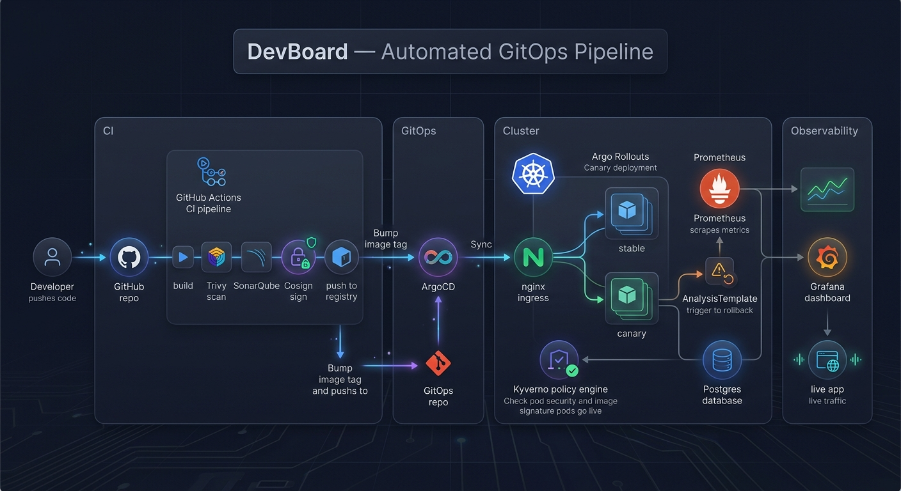
*Code push → CI (build, scan, sign) → GitOps repo → ArgoCD sync → canary rollout via nginx, gated by Kyverno at admission and Prometheus-driven rollback via Argo Rollouts → Grafana + live traffic.*
 

---

## 1️⃣ 🚀 Deployment Frequency & Lead Time

Every push to `master` in the app repo runs `devsecops.yml`: build → scan → sign → push, then a `deploy / update-gitops` job bumps the image reference here via `yq` and pushes straight to this repo. ArgoCD picks that commit up and syncs on its own — there's no manual `kubectl apply` in the deploy path. 🤖

Each successful deploy also pushes a timestamped metric (`devboard_deploy_total`) to a Prometheus pushgateway, so deploy frequency and lead time are numbers on a dashboard 📊, not a claim.

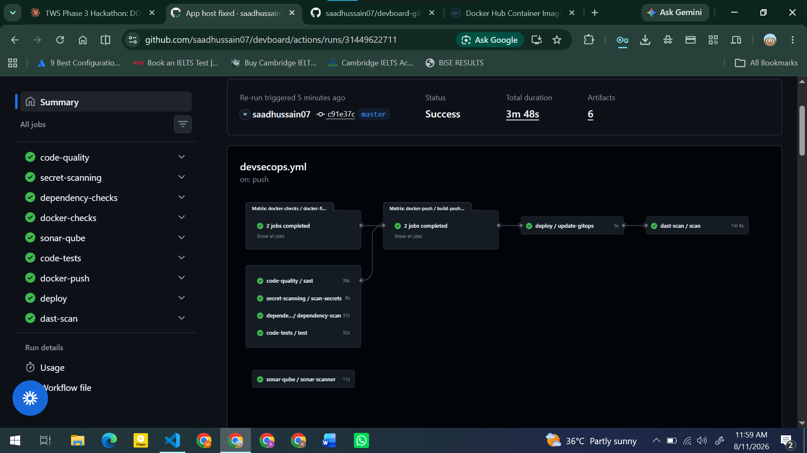
*devsecops.yml — full pipeline green, deploy → update-gitops feeding into ArgoCD.*

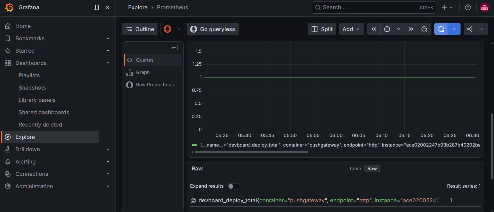
*Deploy Frequency and Rollout Health panels, backed by live cluster data.*


*Raw `devboard_deploy_total` series in Prometheus — the metric behind the dashboard.*

---

## 2️⃣ 🩹 Change Failure Rate & MTTR

The backend deploys through **Argo Rollouts**, not a plain Deployment. [`analysistemplate.yaml`](analysistemplate.yaml) queries the backend's request success rate from Prometheus mid-rollout; if it drops below threshold, the rollout aborts automatically ⛔ — that's the "automated rollback" requirement actually wired to a live metric, not just a manual `kubectl rollout undo`.

Rollout phases (`Progressing`, `Paused`, `Completed`, `Error`, `Abort`, `Timeout`) are exported and tracked over time, so a failed rollout is visible on a dashboard, not just in a terminal someone happened to be watching.

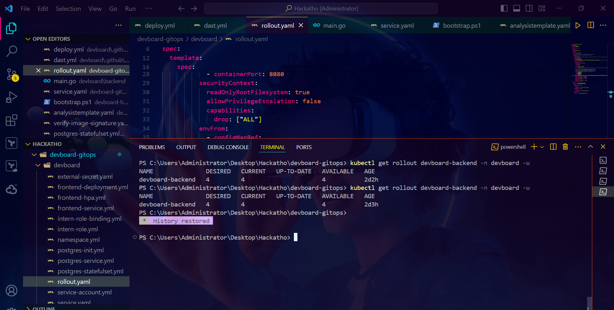
*A rollout reaching a stable, fully-available state after a prior rollback.*

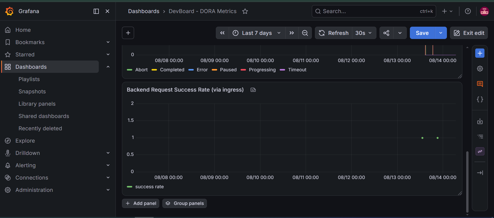
*Change Failure Rate — Rollout Phase Over Time, plotted from real rollout events.*


*Backend Request Success Rate via ingress, correlated with rollout activity.*

---

## 3️⃣ 🐤 Progressive Delivery

[`rollout.yaml`](rollout.yaml) defines the canary strategy. Traffic splitting itself is handled by **nginx ingress-canary annotations** — two Ingress objects share the same host (`api.devboard.<domain>`), one stable and one canary, weighted by nginx as the rollout steps through. ⚖️

This was watched live with `kubectl get rollout devboard-backend -n devboard -w` during an actual deploy, not just read off the YAML.

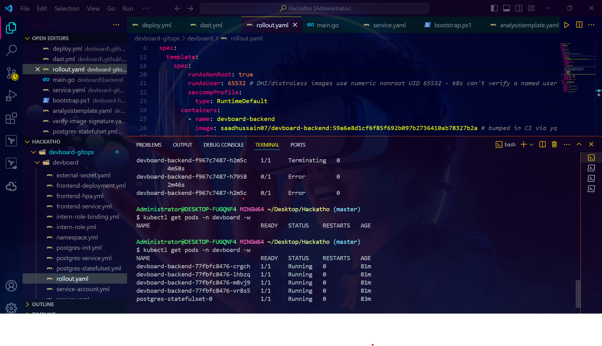
*Backend pods running the digest-pinned image from the current rollout.*

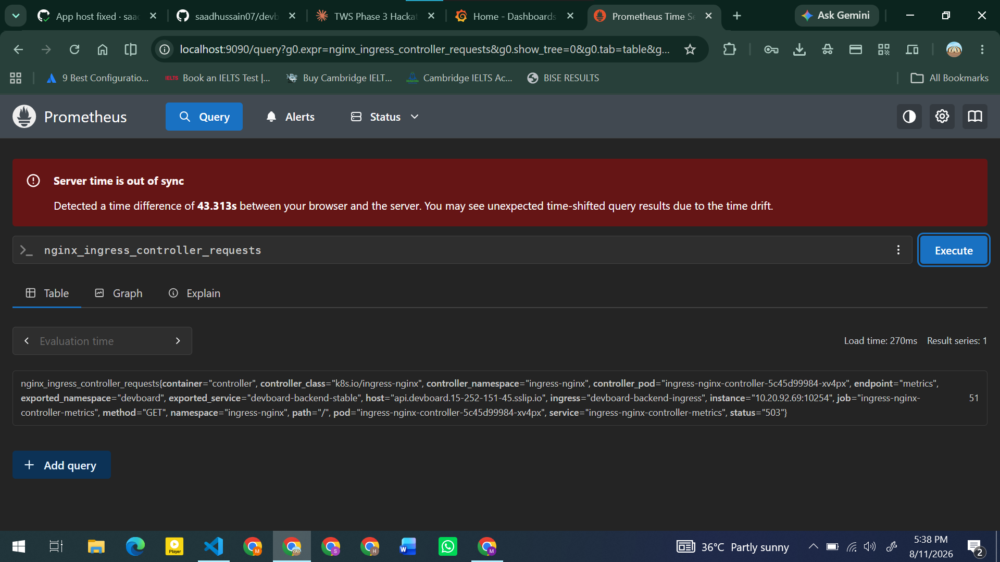
*`nginx_ingress_controller_requests` labeled by the canary ingress, confirming the split is real traffic, not just config.*

---

## 4️⃣ 🛡️ Policy as Code

[`kyverno/`](kyverno/) holds the cluster-side policies. Pod security requirements — `runAsNonRoot`, a `RuntimeDefault` seccomp profile, dropped Linux capabilities, a read-only root filesystem, no privilege escalation — are enforced and visible directly in `rollout.yaml`'s `securityContext`, so they're not just declared in a policy file that may or may not be catching anything. 🔒

Trivy runs inside the `docker-checks` job in the app repo's CI and **fails the pipeline** on high/critical findings 🚨 — it's a gate, not a report nobody reads.

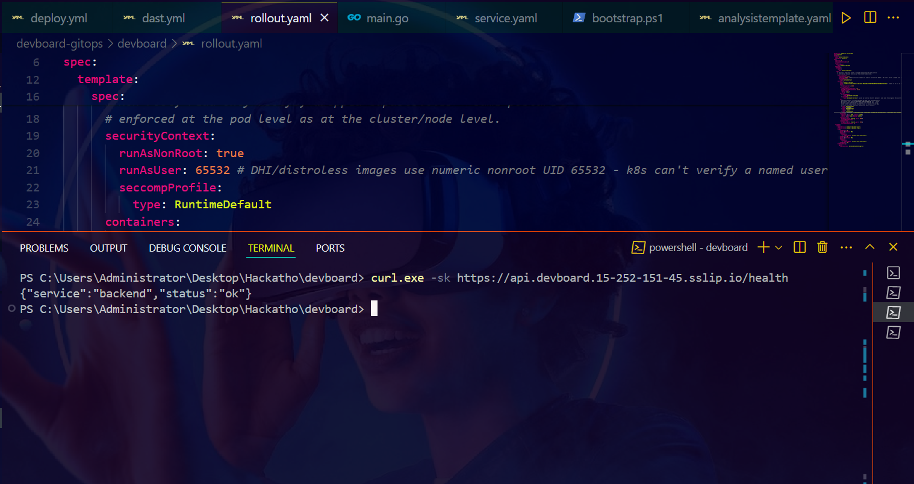
*securityContext block in rollout.yaml — nonroot UID, seccomp, and a live health check against the deployed backend.*


*Container-level hardening: readOnlyRootFilesystem, no privilege escalation, all capabilities dropped.*

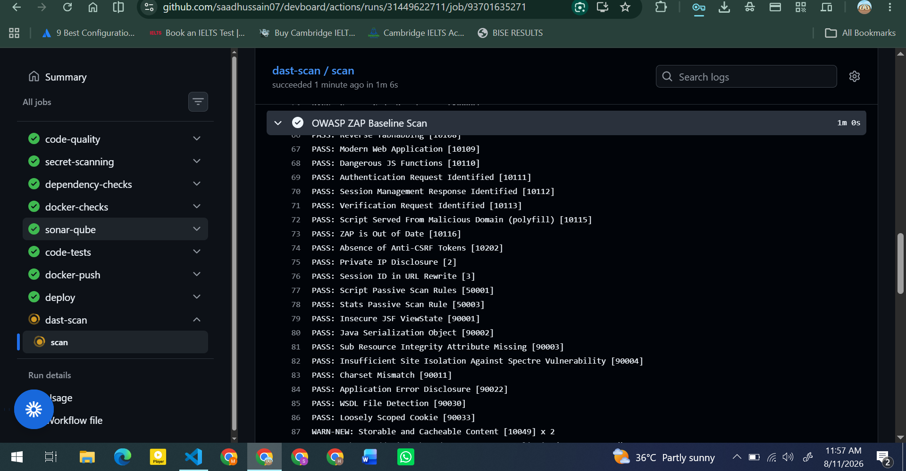
*ZAP baseline scan from the dast-scan CI job — passing checks against the live app.*

---

## 5️⃣ 🔗 Supply Chain Security

Both images are built, pushed, and **signed with Cosign** ✍️ in the `docker-push / build-push-sign` matrix job, with an SBOM generated alongside each build. [`verify-image-signature.yaml`](verify-image-signature.yaml) checks signatures before deploy at admission time. `rollout.yaml` pins the backend to a specific `sha256` digest rather than a mutable tag, so what's running in the cluster is exactly what got scanned and signed — nothing swapped in after the fact. 🔍

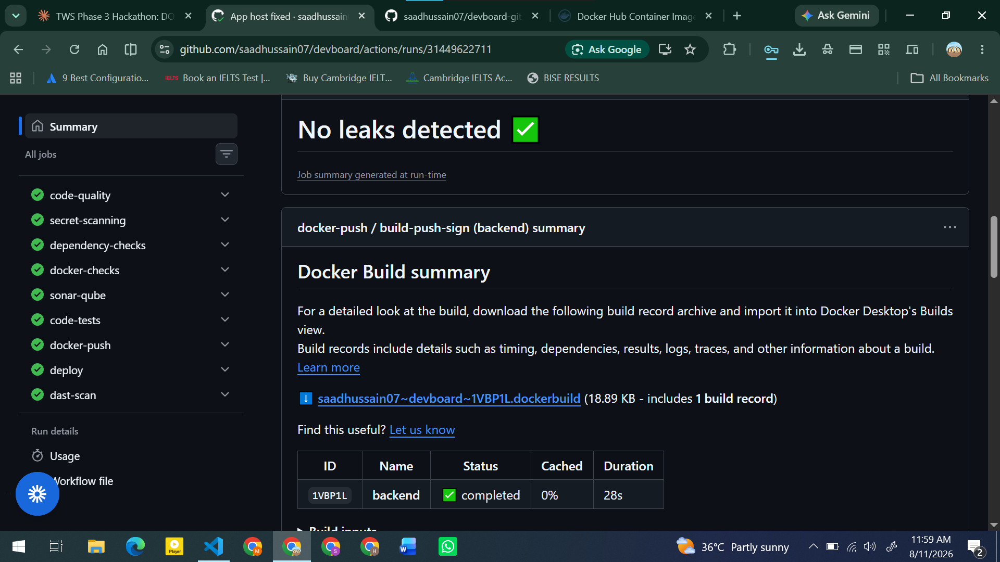
*Signed build record for the backend image, no secrets leaked.*

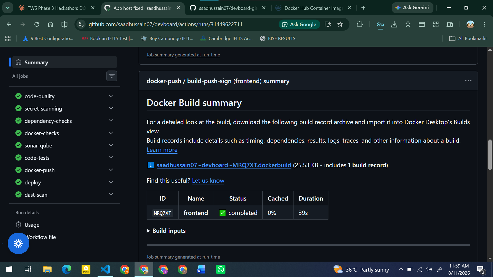
*Signed build record for the frontend image.*

---

## 6️⃣ 📈 DORA Metrics Dashboard

The Grafana dashboard **"DevBoard – DORA Metrics"** pulls from three sources: the pushgateway (deploy events), the ingress-nginx controller (request success/failure), and Argo Rollouts (phase transitions). Together they cover all four DORA metrics — deploy frequency, lead time, change failure rate, and MTTR via rollout phase duration. 🎯

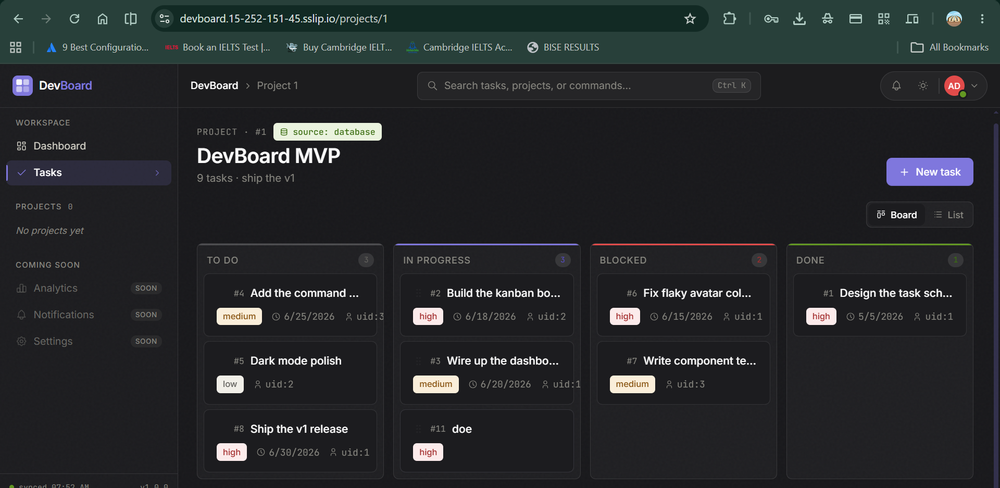
*The deployed app itself, confirming the whole chain — build, sign, scan, deploy, canary — ends in something that actually works.*

---

## ✅ Verified Live, at Submission Time

```bash
$ curl -sk https://api.devboard.15-252-151-45.sslip.io/health
{"service":"backend","status":"ok"}
```

- 🌐 Live URL loads and the app is fully usable: https://devboard.15-252-151-45.sslip.io
- 📝 Created a task end-to-end through the UI and confirmed it landed on the board.

---

## 🔗 Links

| | |
|---|---|
| 📦 App repo | https://github.com/saadhussain07/devboard |
| 🌐 Live app | https://devboard.15-252-151-45.sslip.io |
| 📄 Full compliance write-up | `DevBoard_DORA_SOTA_Compliance_Report.docx` (submitted with the hackathon entry) |

---

<div align="center">

**Built for TWS Phase 3 Hackathon — DORA + SOTA Compliance Challenge** 🏁
Made with ☕ and a lot of `kubectl get pods -w`

</div>
